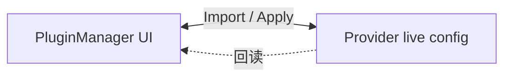

# Plugin Management — Feature Proposal

> Status: Draft(征反馈) · Branch: `feat/plugin-management` · Target: 合入 `main`
>
> Scope: Claude / Codex / Gemini / OpenCode / OpenClaw / Hermes

---

## 1. Summary

为 cc-switch 引入统一的**多 Provider 插件管理**能力,在一个面板内完成 6 个 CLI/IDE provider 的插件启用/禁用与导入,屏蔽各家配置格式差异;**不接管插件的安装/卸载**。当前已在 `feat/plugin-management` 分支完成初版实现,提此 issue 征集合入意见与设计反馈。

---

## 2. Motivation

当前用户若要启用/禁用某个 provider 的插件,需要:

- 找到正确的配置文件(`~/.claude/settings.json`、`~/.codex/config.toml`、`~/.gemini/extensions/extension-enablement.json` …)
- 理解每家私有 schema(JSON / TOML / YAML / 字符串数组,且**语义存在反转**)
- 手工编辑且不能写错,否则 provider 启动会失败

cc-switch 已经统一了 provider 的"账号 / 端点"切换。插件作为下一层级的运行时配置,理应享有同样的统一体验。

实测中暴露的具体痛点:

- **Hermes**:2026-04 schema 由"默认全启"切换到 opt-in,旧用户无感知;手工编辑 `plugins.disabled` 不再有效。
- **OpenCode**:`plugin` 字段是有序数组,排序影响加载,在文本编辑器里很容易破坏。
- **Gemini**:扩展启用状态在独立的 `extension-enablement.json`,新手很难找到。
- **Claude**:`enabledPlugins` 与 `installed_plugins.json` 之间存在 ghost 条目,手工同步易错。

---

## 3. Goals & Non-Goals

### Goals

- 在 cc-switch 中集中查看 / 切换 6 个 provider 的插件启用状态。
- 支持从 provider 当前 live config 一键导入,不破坏用户已有结构。
- 屏蔽不同 provider 的语义反转(如 Hermes opt-in、OpenCode 数组语义)。
- 对 ID 冲突、ghost 条目做最小防御。

### Non-Goals

- **不接管插件安装**:仍走 provider 自身 CLI(`claude plugin install`、`gemini extensions install <url>` 等)。
- **不做跨 provider 同步**:6 家的插件 ID / 能力完全不兼容,强行同步只会引入歧义。
- **不动 project / local scope**:Claude 的项目级插件由项目团队维护,不应被全局工具改写。
- **不抽象统一插件协议**(理由见 §7)。

---

## 4. Proposed Solution

### 4.1 两种 UI 模式

调研发现各 provider 的"启用模型"分两类,因此对应两种 UI 模式。

#### Mode A — 已安装列表 + Checkbox + Apply

适用:Claude / Codex / Gemini / OpenClaw / Hermes

- 列表来源:provider 自身的"已安装注册表"(目录或 manifest)。
- 操作:勾选 → Apply 批量写入 live config。
- 复用组件:`CheckboxPluginTab` + `useCheckboxPluginTab`。

#### Mode B — 配置数组 + 增删排序

适用:OpenCode

- 列表本身就是配置(无独立"已安装"概念)。
- 操作:输入 ID 添加 / 上下排序 / 删除,即时生效,无 Apply 按钮。

### 4.2 Provider 适配总览

| Provider | 模式 | live config 路径 | 关键字段 |
|---|---|---|---|
| Claude | A | `~/.claude/settings.json` | `enabledPlugins`(user scope) |
| Codex | A | `~/.codex/config.toml` | `[plugins."id"] enabled` |
| Gemini | A | `~/.gemini/extensions/extension-enablement.json` | per-extension bool |
| OpenCode | B | `~/.config/opencode/opencode.json` | `plugin: [..]` 有序数组 |
| OpenClaw | A | `~/.openclaw/openclaw.json` | `plugins.entries.<id>.enabled` |
| Hermes | A | `~/.hermes/config.yaml` | `plugins.enabled` + `plugins.disabled` |

### 4.3 数据流

所有 6 个 provider 的 UI 都**直接读写各自的 live config**,不引入 cc-switch 内部状态层。Claude / OpenCode 的 provider sync 在写回 live config 时采用 **merge 策略**(保留 `enabledPlugins` / `plugin` 字段),确保 provider 切换不会覆盖用户已做的插件选择。

### 4.4 关键设计决策

| # | 决策 | 取舍理由 |
|---|---|---|
| D1 | 统一 UI 框架,但保留两种交互模式 | 强行一刀切会破坏 OpenCode 的数组语义 |
| D2 | UI 上一律"勾选 = 启用",后端做语义翻译 | 避免把 Hermes 的 `disabled` 反向语义暴露给用户 |
| D3 | Claude 用 `installed_plugins.json` 过滤 ghost | `enabledPlugins` 中存在但未安装的条目应隐藏 |
| D4 | OpenCode 做 OMO 互斥校验 | `oh-my-openagent` 与其变体不能同时启用 |
| D5 | 只管理 user scope | project / local scope 应由项目维护者管理,不归 cc-switch |
| D6 | Hermes 同时维护 `enabled` 与 `disabled` 两个数组 | 跟随 2026-04 schema 的 opt-in 语义 |

---

## 5. Implementation Status

### 5.1 已合入(`feat/plugin-management` 分支)

| Phase | Provider | 模式 | 提交 |
|---|---|---|---|
| 1–5 | Claude / Codex / OpenCode / OpenClaw / Hermes | A / B | `a54025b3` |
| 6 | Gemini | A | `732b82d3` |
| Fix | Hermes opt-in 语义修正 | A | `4e7e00b4` |

无新增持久化层:所有 provider 均直接读写各自 live config,不引入 SQLite 中间表。

### 5.2 进行中 / 待办

- [x] **Codex P1 验证**:确认 `~/.agents/plugins/marketplace.json` 是否始终同步到 `config.toml` 的 `[plugins]`;若不同步需合并读。—— ✅ 已完成 (`b3aff3bb`)。
- [ ] **OpenClaw P2 增强**(可选):利用 `plugins/installs.json` 展示版本号;在全局 `plugins.enabled = false` 时给出明显提示。
- [x] **错误文案 i18n 补全**:Apply 失败、配置解析异常等边界文案的中/英/日补齐。—— ✅ 已完成 (`490451f6`, `8e788ddb`)。
- [ ] **回归测试**:对 6 个 provider 的 `import → toggle → apply` 链路加 e2e 用例。—— 暂缓至后续迭代。

---

## 6. Scope & Risks

### 风险与缓解

| 风险 | 缓解 |
|---|---|
| 修改 live config 损坏用户已有结构 | 所有写入采用"读改写",保留未知字段;Apply 前在前端展示差异。 |
| Provider sync 覆盖用户插件选择 | Claude sync merge 保留 `enabledPlugins`;Codex sync merge 保留 `[plugins]`;OpenCode/OpenClaw/Hermes sync 均为字段级写入,不动插件字段;Gemini 插件在独立文件。 |
| Provider schema 变更使行为悄悄失准(如 Hermes opt-in) | 各 provider 的 schema 假设集中在对应 commands 模块,新增 schema 检测兜底。 |
| 用户混淆 cc-switch 与 provider 自身 CLI 的责任边界 | 文案明确"cc-switch 不安装、只切换";导入按钮显式标注数据源。 |
| ghost 条目误显示 | Claude 用 `installed_plugins.json` 过滤;其余 provider 列表来自实物扫描。 |

### 显式不做

- 不接管安装 / 卸载
- 不跨 provider 同步
- 不动 project / local scope
- 不抽象统一插件协议

---

## 7. Alternatives Considered

**A. 一刀切 Checkbox(全部走 Mode A)**
所有 provider 统一用"已安装列表 + 勾选"。问题:OpenCode 没有独立的"已安装注册表",`plugin` 数组本身就是配置且有序,Mode A 表达不出"位置"这一信息。**放弃**。

**B. 抽象统一插件协议**
设计一个 cc-switch 内部的"通用插件描述",6 个 provider 各写适配器。问题:6 家的 ID 命名空间、生命周期、能力模型完全不同,抽象层会比直接适配更复杂;且任一 provider 微调都得改抽象层。**放弃**,优先"轻包装、各管各"。

**C. 只做 Claude**
只支持最主流的 Claude,其他 provider 仍走手工编辑。问题:cc-switch 的核心定位是多 provider 统一管理,只做 Claude 与定位冲突。**放弃**。

---

## 8. Open Questions

希望在 review 中得到反馈:

1. **OpenClaw `plugins.enabled` 全局开关**是否要纳入 UI?当前倾向于"不接管,仅在它为 false 时给出警告",还是应该提供一键打开?
2. **Codex marketplace** 的 `marketplace.json` 是否需要进入 cc-switch 的可视范围?(取决于 §5.2 P1 的验证结果。)
3. **Mode A 表项的"详细配置"入口**(例:OpenClaw `config.apiKey`)v1 是否要做,还是留给后续 issue?

---

## 9. References

- 关键提交:`a54025b3` · `732b82d3` · `4e7e00b4`
- 实现入口:
  - 后端:`src-tauri/src/commands/{claude,codex,gemini,opencode,openclaw,hermes}_plugins.rs`
  - 前端:`src/components/plugins/PluginManager.tsx`
